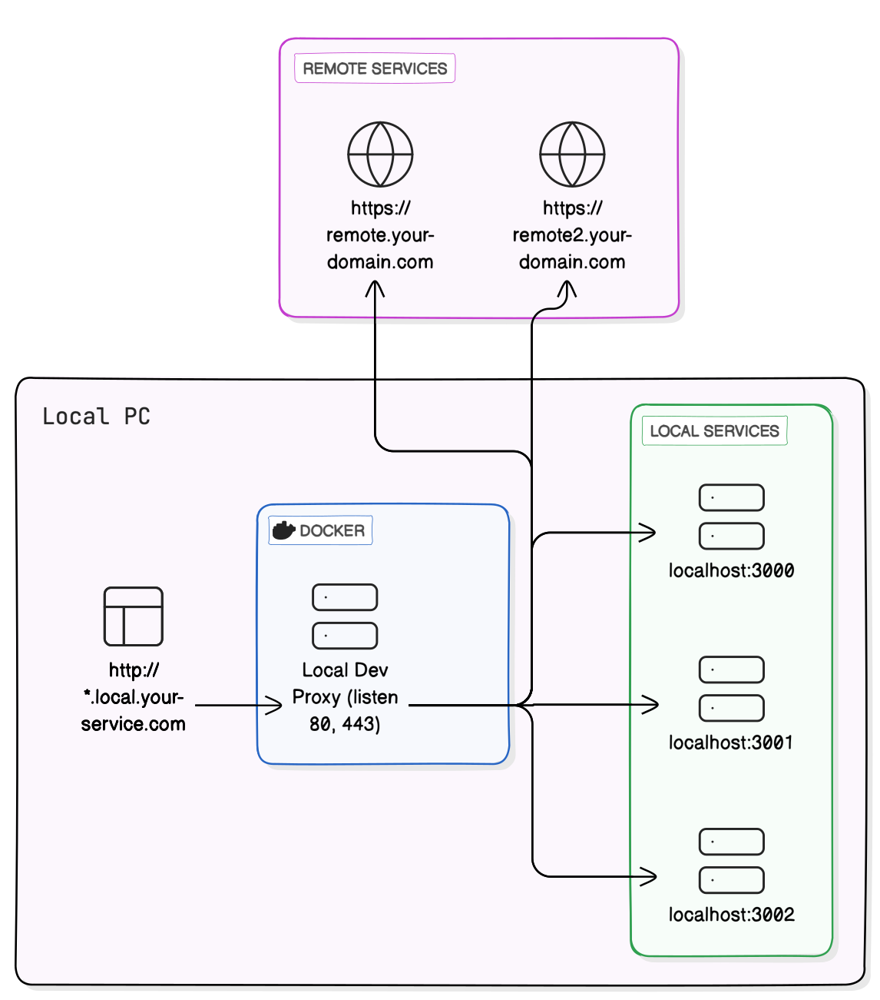
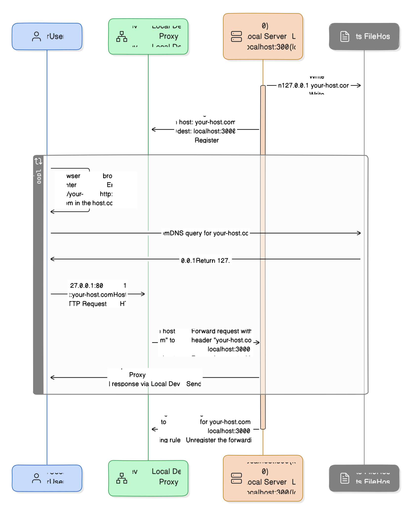

[](./README.ko.md)
[](./README.md)

# Local Dev Proxy

로컬 개발 환경에서 80(http), 443(https) 포트로 동시에 여러 서버의 서비스를 도와주는 프록시 서버

[](https://www.npmjs.com/package/local-dev-proxy)
[](https://github.com/gumab/local-dev-proxy)
[-2496ED?logo=docker)](https://hub.docker.com/r/gumab/local-dev-proxy)
[-red)](https://support.apple.com/en-us/116943)

## 개요



로컬 개발 시 여러 서버를 관리하는 것은 도전적일 수 있습니다.
개발을 하다 보면 동시에 여러 대의 서버를 80포트로 실행하고 싶은 경우가 있습니다.
**Local Dev Proxy**는 로컬 서버를 동적으로 등록하고, 사전에 정의된 설정에 따라 요청을 적절한 서버로 라우팅하여 이 문제를 해결합니다.

## 주요 기능

- 여러 로컬 서버를 동시에 80, 443 으로 접근 가능
- 호스트 또는 경로 설정에 따라 요청을 적절한 로컬 서버로 라우팅
- `/etc/hosts` 파일 자동 등록 및 라우팅
- HTTPS 지원
    - 자동으로 로컬 도메인에 대해 인증서 발급 및 적용

## 구성 요소

### Server

- 프록시 역할을 하는 Docker 서버
- 80/443 포트를 점유
- API를 통해 로컬 서버를 등록/해제
- 등록된 규칙에 따라 요청을 타깃 서버로 라우팅

### Launcher

- 각 프로젝트 내 라이브러리로 위치
- 프록시 서버 실행 (미실행 시)
- 현재 실행 중인 프로세스가 점유하는 포트를 확인하여 서버에 등록
- 설정 파일을 통해 호스트 정보 설정
- 호스트 설정이 누락된 경우 추가 처리

## Flow



## 빠른 시작

### 1. 설치

```bash
# optional 로 설치하지 않으면 linux 서버 등에서 npm install 시 오류가 발생할 수 있습니다.
$ npm install local-dev-proxy --optional
```

### 2. Configuration 파일 설정

프로젝트 루트에 `.ldprxrc.js` 파일을 생성하고 다음 내용을 추가합니다:
> 패키지 설정이 ESModule 인 경우 `.ldprxrc.cjs` 를 사용합니다.

```js
/** @type {import('local-dev-proxy').LocalDevProxyOption} */
module.exports = {
  rule: {
    key: 'sample-key',
    host: 'simple.local.your-domain.com',
  },
};
```

[Configuration File Samples](./packages/launcher/config-samples)

### 3. 실행

#### `package.json`
```json
"scripts": {
  "start": "ldprx your-run-command"
}
```
Or
```bash
$ npx ldprx your-run-command
```

[Example App](./example)
