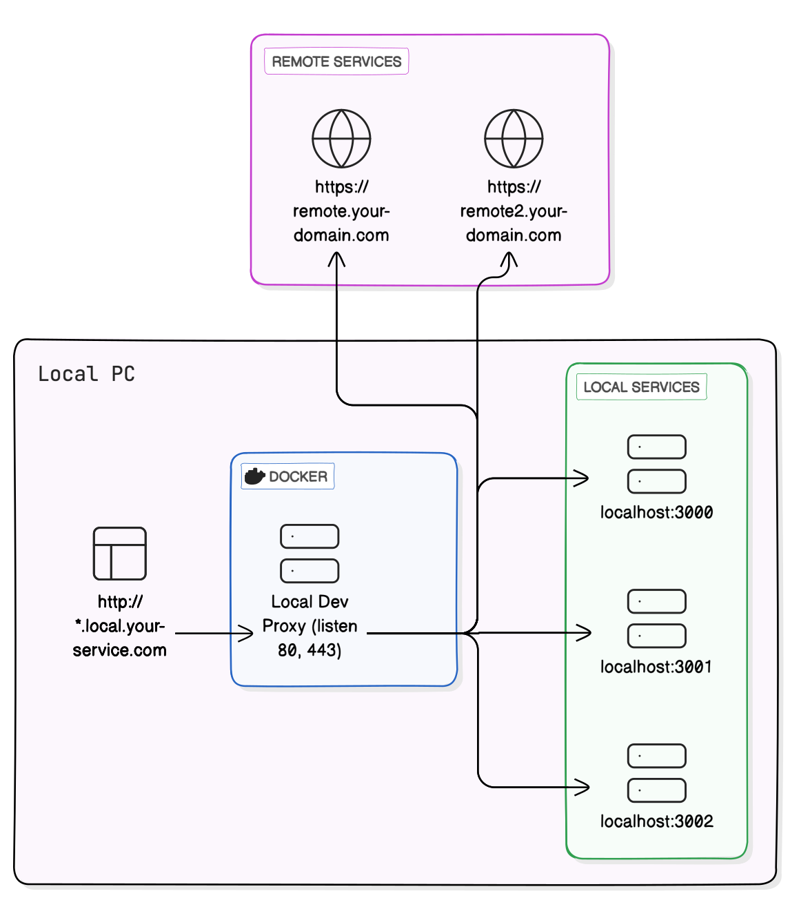

[](./README.ko.md)
[](./README.md)

# Local Dev Proxy

A proxy server to assist with running multiple server services simultaneously on ports 80 (HTTP) and 443 (HTTPS) in a
local development environment.

-blue)

## Overview



Managing multiple servers during local development can be challenging. Often, you might want to run multiple servers
simultaneously on port 80. **Local Dev Proxy** addresses this issue by dynamically registering local servers and routing
requests to the appropriate server based on predefined configurations.

## Key Features

- Access multiple local servers simultaneously on ports 80 and 443.
- Route requests to the appropriate local server based on host or path configuration.
- Automatic registration and routing via `/etc/hosts` file.
- HTTPS support:
    - Automatically issues and applies certificates for local domains.

## Components

### Server

- A Docker server acting as a proxy.
- Occupies ports 80/443.
- Registers/unregisters local servers via an API.
- Routes requests to the target server based on registered rules.

### Launcher

- Located within each project as a library.
- Runs the proxy server (if not already running).
- Registers the port occupied by the currently running process with the server.
- Configures host information through a configuration file.
- Handles additional processing if host configuration is missing.

## Flow


## Quick Start

### 1. Installation

```bash
# If not installed as optional, errors may occur during npm install on Linux servers, etc.
$ npm install local-dev-proxy --optional
```

### 2. Configure the Configuration File

Create a `.ldprxrc.js` file in the project root and add the following content:

```js
/** @type {import('@gumab/local-dev-proxy').LocalDevProxyOption} */
module.exports = {
  rule: {
    key: 'sample-key',
    host: 'simple.local.your-domain.com',
  },
};
```

### 3. Run

#### `package.json`

```json
"scripts": {
  "start": "ldprx your-run-command"
}
```

Or

```bash
$ npx ldprx your-run-command
```
